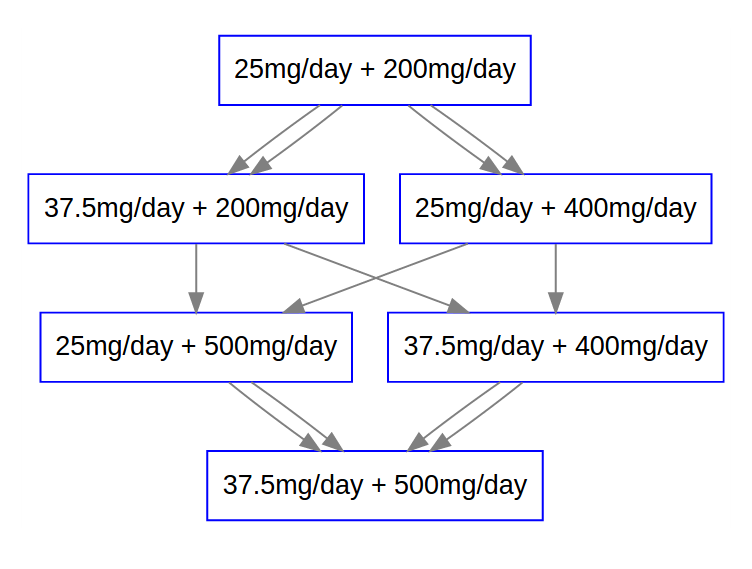
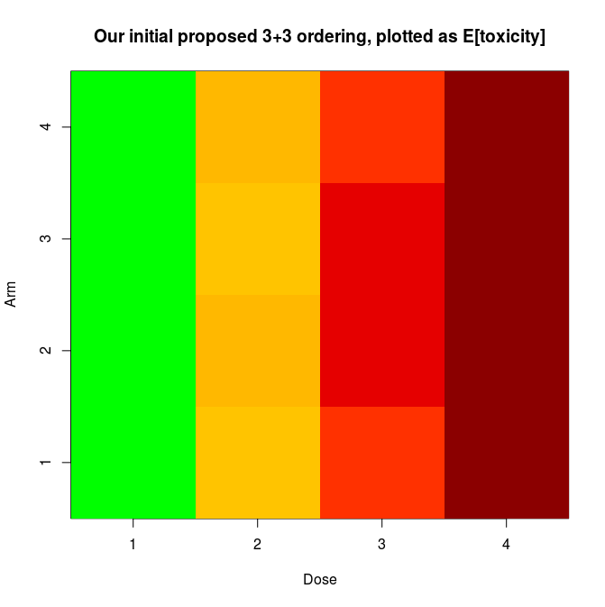

# pocrmplot
fussing with PO-CRM and plotting the actual dose escalation path (AACR workshop)
  
setup for PO-CRM with our initial dose escalation plan (probably not optimal):

```R 
library(pocrm)

## for POCRM 
dosing <- list(sunitinib=c(25, 37.5), crizotinib=c(200, 400, 500))
doses <- lapply(dosing, paste0, "mg/day")
 
## this is essentially a WAG, which is WHY POCRM makes sense (updating)
getTox <- function(dosing, target) (dosing / max(dosing)) * target
doseTox <- lapply(dosing, getTox, target=0.3)
toxGuess <- apply(expand.grid(doseTox), 1,
                  function(x) 1 - (1 - x[1]) * (1 - x[2]))

schedules <- apply(expand.grid(doses$sunitinib, doses$crizotinib), 1, 
                   function(x) paste(x, collapse=" + "))
names(schedules) <- paste0("dose", seq_along(schedules))
names(toxGuess) <- schedules
schedules <- schedules[order(toxGuess)] 
toxGuess <- toxGuess[order(toxGuess)] 
names(schedules) <- paste0("dose", seq_along(schedules))
names(toxGuess) <- names(schedules)
schedules <- schedules[order(toxGuess)] 
toxGuess <- toxGuess[order(toxGuess)] 

## exhaustive, for plotting graphs 
paths <- list(arm1=c(1,2,4,6),
              arm2=c(1,3,5,6),
              arm3=c(1,2,5,6),
              arm4=c(1,3,4,6))

## plot them 
library(DiagrammeR)
source("plotPath.R")
plots <- with(paths, 
              list(arm1=plotPath(arm1, schedules, name="arm1"), 
                   arm2=plotPath(arm2, schedules, name="arm2"), 
                   arm3=plotPath(arm3, schedules, name="arm3"), 
                   arm4=plotPath(arm4, schedules, name="arm4")))
viz <- "
  digraph paths {

    # graph attributes
    graph [overlap = true]

    # node attributes
    node [shape = box, fontname = Helvetica, color = blue]

    # edge attributes
    edge [color = gray]"
viz <- paste(viz, paste(do.call(c, plots), collapse="\n"), sep="\n")
viz <- paste(viz, "  }\n")
grViz(viz)
```

  

Why PO-CRM?  When we go through the exercise of generating guesses for toxicity, it turns out our hypothetical partial ordering for 3+3 dose escalations by toxicity wasn't exactly correct:

```R
## initial working model 
alpha <- do.call(rbind, lapply(paths, function(x) toxGuess[x]))
colnames(alpha) <- paste0("toxAtDose", 1:4)
## note that the partial ordering here is different than we thought, in `paths`!

## get priors for pocrm assignment:
prior.o <- rep(1, length(paths)) / length(paths)

## seed the RNG:
set.seed(123456)

## get skeleton of updates to model
combos <- sort(ceiling(runif(10)*6))

## get simulated toxicities
tox <- rbinom(length(combos), 1, toxGuess[combos])
fit <- pocrm.imp(alpha, prior.o, theta=0.3, y=tox, combos)

# 
# so instead of fixed random escalation/assignment, rely on PO-CRM to guide dose
# why? because our original idea wasn't so great, if my model is reasonable.
# plot the alpha matrix:
#
stoplight <- colorRampPalette(c("green", "yellow", "orange", "red", "darkred"))
image(x=1:4, y=1:4, z=t(alpha),
      main="Our initial proposed 3+3 ordering, plotted as E[toxicity]",
      xlab="Dose", ylab="Arm",
      col=stoplight(256))
```



